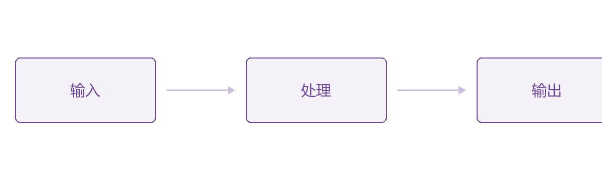
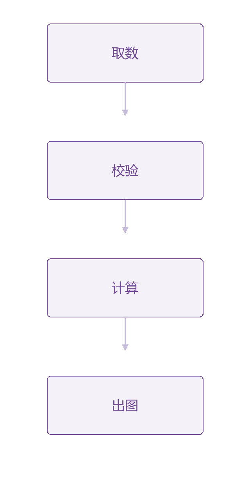

# 软件工程研究什么？

## 怎么把一件大事，在**人和工具的共同协作**下做成?

- 有技术，也有人类学、社会学、管理学的部分（人因）
- [ICSE 2027 Call for Papers](https://conf.researchr.org/home/icse-2027): AI4SE, Analytics, Architecture and Design, Dependability and Security, Evolution, Human and Social Aspects, Requirements and Modeling, SE4AI, Testing and Analysis
- 教育体系“考试就是终点”的弊端
- 所有“考题”都是分钟级能求解的；大作业可以摸鱼
- 没有 self-motivation，就从未训练过如何解决 long-horizon 的问题

> 工程能力，是在稀疏、延迟的反馈下仍能维持方向；软件工程因此同时组织技术、协作关系、人的动机和时间。

---

# Intent, Spec 与 Impl

## 三个空间

- **Intent Space**：需求的提出者也不 100% 确定他想要什么，比如“给我弄一个国民级的应用”
- **Spec Space**：从 Intent 到 Spec，已经曲解了很多
- **Impl Space**：计算机程序只接受 100% 无歧义的指令

## “正确”发生在哪一层？

> Impl = Spec 只说明“按规格正确”，并不推出“满足意图”；测试可以证明前者，却无法替人决定后者。

---

# 列表与表格

## 嵌套列表

- 一级条目
  - 嵌套条目
- 第二个一级条目，带 `行内代码` 与 [链接](https://example.com)

### 三级标题

| 层次 | 含义 | 判定者 |
| --- | --- | --- |
| Intent | 想要什么 | 人 |
| Spec | 写清楚什么 | 人 + 评审 |
| Impl | 代码怎么跑 | 机器 |

> 引用块里也可以有 **强调**、`代码` 和[链接](https://example.com)。

---

# 代码与引用

## 代码块

```python
def solve(intent, spec):
    """只对 Spec 负责，不对 Intent 负责"""
    return [step for step in spec if step.verifiable]
```

## 引用块

> 需求提出者说不清楚 → Spec 写不完整 → 代码只能做规格里写的事。
>
> 三者之间的落差，就是软件工程要处理的东西。

---

# 引导词：后面接列表或提示框都行

第一组

- 项目一
- 项目二

第二组

> 一句话结论

*两条紫色小标签：上面那条后面是列表，下面那条后面是提示框，渲染完全一致。*

---

# 无标题栏的页面

这一页有 h1，所以标题栏在。删掉 h1 之后标题栏会自动隐藏。

---

这一页没有 h1，所以顶部紫色标题栏自动隐藏，内容从 56px 处开始。

- 适合做封面、章节分隔页、总结页
- 只要加上 `# 标题`，标题栏就会回来

> 想一直显示标题栏，就删掉主题文件里 `section:not(:has(h1))` 那两条规则。

---

<!-- _class: cols2 -->

# 布局类：cols2

## 把列表拆成两栏

<!-- 本页用了 `<!-- _class: cols2 -->`，顶层列表会自动分成左右两栏 -->

基础题：

1. 移动零
2. 移除元素
3. 反转字符串
4. 验证回文串
5. 盛最多水的容器

进阶选择：

1. 三数之和
2. 接雨水

---

<!-- _class: cols2 compact -->

# 布局类：compact

## 内容多的页面可以叠加使用

<!-- 本页用了 `<!-- _class: cols2 compact -->`，字号 20px、行高 1.5 -->

基础题：

1. 二分查找
2. 搜索插入位置
3. x 的平方根
4. 第一个错误的版本
5. 寻找旋转排序数组中的最小值

进阶选择：

1. 搜索旋转排序数组
2. 爱吃香蕉的珂珂
3. 使结果不超过阈值的最小除数

学习重点：

- 区间收缩
- 边界条件
- 单调性
- 返回值语义

---

# 图片：单图独占一页（上限自动到 561px）



---

<!-- _class: img-full -->



*图 1：img-full 布局类把上限放开到 640px，紧跟图片的斜体段落自动变成图注*

---

# 图片：和正文混排（上限 380px）

## 竖版长图会被压到这个高度，不会顶穿画布

- 混排的图不会溢出，但也不会很大


> 和正文挤一页的图最高 380px；单独一页会自动到 561~618px。

---

# 图片：并排和指定尺寸

 

- 一个段落里并排放多张图：自动居中，中间留出间隔
- `![w:520]` 指定宽度、`![h:300]` 指定高度，单位是 px
- 不支持百分比：`![w:50%]` 会被 Marp 丢掉，图还是原样大小
- 只写一个就行；两个都写会强制拉伸成那个形状（竖图用 `h:` 最直观）
